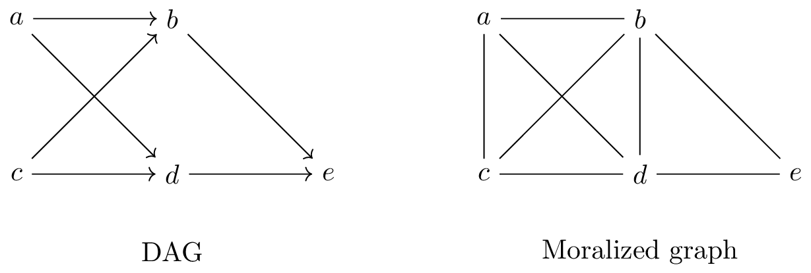
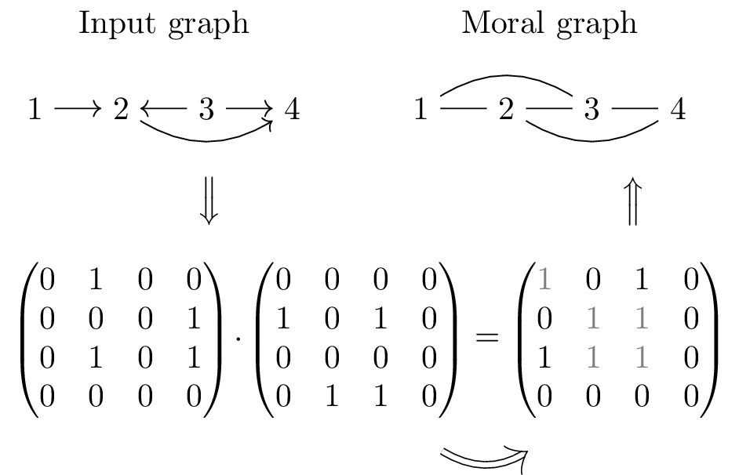
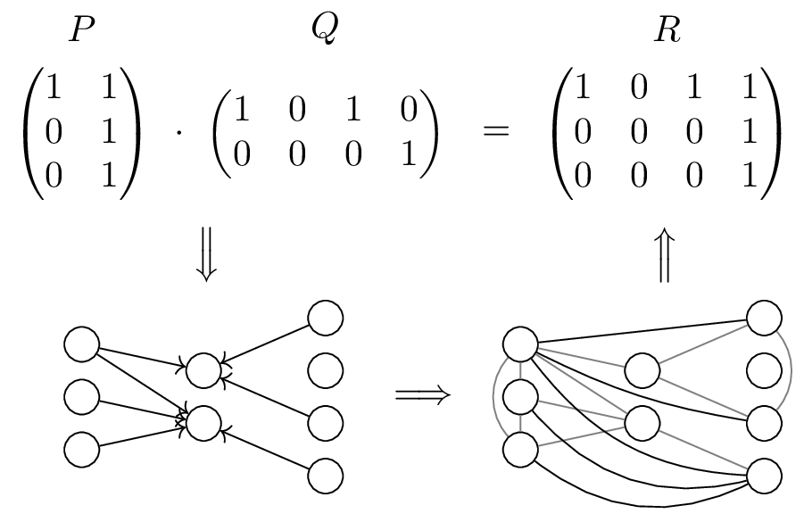

#### Introduction
This blog post is about the computational complexity of [graph moralization](https://en.wikipedia.org/wiki/Moral_graph). The main point is to show that this problem is computationally equivalent to Boolean matrix multiplication (BMM). This refutes previous claims that moralization of directed acyclic graphs (DAGs) can be performed in time $O(n^2)$, with $n$ being the number of vertices, as this would necessitate a major algorithmic breakthrough. The only truly subcubic algorithms known for BMM are based on fast matrix multiplication, which is still firmly away from quadratic time. 

Graph moralization is an important primitive in the field of probabilistic and causal graphical models. Given a DAG, it adds an edge between non-adjacent vertices $x$ and $y$ if they have a common child $z$ and afterwards makes all edges undirected. 



Boolean matrix multiplication is defined for matrices $P \in \{0,1\}^{n_1 \times n_2}, Q \in \{0,1\}^{n_2 \times n_3}$ as 
$$
	(P\cdot Q)_{ij} = \bigvee_{k = 1}^{n_2} (P_{ik} \land P_{kj}),
$$
that is it can obtained from the standard matrix product by replacing addition with *logical or* and multiplication with *logical and*. A basic example is:

$$
\begin{pmatrix}
1 & 0 & 1 \\
0 & 1 & 0 \\
1 & 1 & 0
\end{pmatrix}
\cdot
\begin{pmatrix}
1 & 0 & 0 \\
0 & 1 & 0 \\
0 & 1 & 1
\end{pmatrix}
=
\begin{pmatrix}
1 & 1 & 1 \\
0 & 1 & 0 \\
1 & 1 & 0
\end{pmatrix}
$$


#### Related Work
Moralization transforms a directed to an undirected graphical model and has two main applications:
- To perform inference in Bayesian networks, it is common to use moralization to obtain an undirected graph, which is then amenable to the toolbox of inference algorithm for this model class, e.g., the junction tree algorithm. This undirected graph has the property that it encodes the largest possible subset of conditional independencies of the directed model.
- Moralizing a certain subgraph of a DAG allows for testing d-separation (i.e., implied conditional independence statements of a Bayesian network) through the conceptually simpler (vertex) separation in undirected graphs. This fact has been used for finding (minimal and minimum) d-separating sets as it allows to use well-studied algorithms available for undirected graphs.  

The time complexity of computing the moralized graph has not been
discussed in much depth, likely due to its apparent simplicity and because, e.g., when used
in exact inference routines, which have exponential run-time on
general graphs, it is usually not
the bottleneck. However, in the context of testing and finding
d-separators in DAGs, it usually is the most expensive part of the
algorithm as the remaining steps are simple to perform on undirected
graphs and often take linear time in the number of vertices and edges.

In the corresponding literature, the time complexity of moralization is predominantly stated as $O(n+m')$, with $m'$ being the number of edges in the output graph, or
as $O(n^2)$ in terms of only $n$. The first such reference is given in [Geiger, Verma, Pearl (1990)](https://arxiv.org/abs/1304.1505) and later repeated in [Tian, Paz, Pearl (1998)](https://ftp.cs.ucla.edu/pub/stat_ser/r254), [Javidian, Valtorta (2018a)](https://www.researchgate.net/publication/326998693_Finding_Minimal_Separators_in_Ancestral_Graphs), [Javidian, Valtorta (2018b)](http://proceedings.mlr.press/v72/javidian18a.html) and [Javidian, Valtorta, Jamshidi (2020)](https://arxiv.org/abs/2002.10870), which use moralization for finding minimal d-separators, as well as [Textor, Liskiewicz (2011)](https://arxiv.org/abs/1202.3764), [van der Zander, Liskiewicz, Textor (2014)](http://auai.org/uai2014/proceedings/individuals/209.pdf), [van der Zander, Liskiewicz, Textor (2019)](https://www.sciencedirect.com/science/article/pii/S0004370219300025) and [Jeong, Tian, Bareinboim (2022)](https://arxiv.org/abs/2210.05816), which use it in the context of computing back-door respectively front-door adjustment sets. 
However, this run-time analysis is incorrect and off by a factor of $n$.[^1]

[^1]: A naive implementation of moralization has worst-case run-time $O(n^3)$, despite being claimed as $O(n^2)$ in these works, hence the missing factor $n$. Being more precise, because moralization is computationally equivalent to BMM, the time-complexity of moralization can be stated, at least theoretically, as $O(n^{2.37286})$, the current run-time of fast matrix multiplication, which is off from $n^2$ by a factor of merely $n^{0.37286}$. 

It should be noted that, for the majority of these applications, the state-of-the-art algorithms given by [van der Zander, Liskiewicz (2020)](https://proceedings.mlr.press/v115/van-der-zander20a.html) and [Wienöbst, van der Zander, Liskiewicz (2022)](https://arxiv.org/abs/2211.16468) do *not* rely on moralization and are hence not affected.

Moreover, there are works which correctly analzye the moralization time-complexity such as [Xia, Prasanna (2007)](https://ebooks.iospress.nl/volumearticle/26183), [An, Cercone (2009)](https://link.springer.com/chapter/10.1007/978-3-642-05258-3_6), [Xiang (2002)](https://www.cambridge.org/core/books/probabilistic-reasoning-in-multiagent-systems/C78168FDA67EF5E2EEBB9C63AC70EAD2) and [Heisterkamp (2009)](https://www1.maths.leeds.ac.uk/statistics/workshop/lasr2010/proceedings/L2010-14.pdf). 
In the last work, it is shown that graph moralization can be directly solved by BMM. Let's start by revisiting this result.

#### Solving Graph Moralization by BMM

[Heisterkamp (2009)](https://www1.maths.leeds.ac.uk/statistics/workshop/lasr2010/proceedings/L2010-14.pdf) states that graph moralization is possible through BMM. More formally:

**Theorem 1** [[Heisterkamp (2009)](https://www1.maths.leeds.ac.uk/statistics/workshop/lasr2010/proceedings/L2010-14.pdf)]    
Let $G$ be a DAG and there exist an $O(T(n))$ time algorithm for BMM for square matrices of dimension $n$. Then, the graph $G$ can be moralized in time $O(T(n))$. 

*Proof.*   
Let $A$ be the adjacency matrix of $G$, i.e., $A[i,j] = 1$ if $v_1
\rightarrow v_j$ in $G$.  Add all edges $v_i - v_j$ to $G$, where the matrix product $C = A
\cdot A^T$ has $C[i,j] = 1$ and $v_i$ and $v_j$ were previously
non-adjacent (for $i \neq j$). Afterwards, make the directed edges undirected to
obtain the moralization of $G$. 
  
The correctness follows as $C[i,j] = 1$ precisely if there is a $k$ such
that $v_i \rightarrow v_k$ and $v_k \leftarrow v_j$, as this
corresponds to $A[i,k] = 1$ and $A^T[k,j] = 1$. 

Observe that $T(n) \in \Omega(n^2)$. Then, it is easy to see that (i) forming the adjacency matrix and its transpose, (ii) computing the matrix product and (iii) constructing the resulting graph can all be performed in $O(T(n))$. $\square$

For an example, consider the following illustration of this reduction. 



#### Computational Equivalence of Graph Moralization and BMM
To show computational equivalence, it hence remains to prove that BMM can be solved by graph moralization. The underlying reduction is straightforward, relying on the well-known interpretation of BMM in terms of tripartite graphs:

**Theorem 2**     
Let $P \in \{0,1\}^{n_A \times n_B}, Q \in \{0,1\}^{n_B \times n_C}$ be two boolean matrices and let there
exist an $O(T(n))$ worst-case time algorithm for moralizing an $n$
vertex graph. Then, the
boolean matrix product $R = P \cdot Q$ can be computed in worst-case time
$O(T(n_A + n_B + n_C))$.  

*Proof.*     
Construct a graph $G$ with vertex set $A \cup B \cup C$ consisting
of $n_A$, $n_B$ and $n_C$ vertices, respectively. Insert
edges $a_{i} \rightarrow b_{j}$ if $P[i,j] = 1$ and edges
$b_{i} \leftarrow c_{j}$ if $Q[i,j] = 1$. Note that this graph is
by definition acyclic. Then, moralization will add an edge
$a_{i} - c_{j}$ if, and only if, $R[i, j] = 1$ as this only
happens in case there is $k$ such that $P[i, k] = 1$ and $Q[k, j] =
1$.

For the run-time analysis, consider the three steps of the sketched
algorithm: (i) building graph
$G$, (ii) performing moralization of graph $G$ and (iii)
constructing the resulting matrix $R$.

As $G$ has $n_A + n_B + n_C$ vertices, (ii) takes time
$O(T(n_A+n_B+n_C))$ by assumption. The time complexity of
(i) can be bounded by $O(n_A \cdot n_B + n_B
\cdot n_C)$, which in turn is in $O((n_A + n_B + n_C)^2)$. Because, as before,
$O(T(n))$ is necessarily in $\Omega(n^2)$ (every algorithm for
moralization has to add $\Omega(n^2)$ edges in the worst-case),
it follows that $O((n_A + n_B + n_C)^2)$ is in $O(T(n_A+n_B+n_C))$.
For (iii), similar arguments apply as it can be bounded by $O(n_A
\cdot n_C)$. $\square$

The following figure illustrates this approach:



#### Related Problems

These techniques can be used and generalized to tackle related problems as well: 
- The problem of moralizing [ancestral graphs](https://projecteuclid.org/journals/annals-of-statistics/volume-30/issue-4/Ancestral-graph-Markov-models/10.1214/aos/1031689015.full), also known as the augmented graph (see, e.g. Section 3.2 in [van der Zander, Liskiewicz, Textor (2019)](https://www.sciencedirect.com/science/article/pii/S0004370219300025)), is also equivalent to BMM as can easily be proved by generalizing Theorem 1.
- The same holds for the problem of computing the [latent projection](https://www.sciencedirect.com/science/article/abs/pii/S0049237X06800741) of a DAG with unobserved variables. This can be shown by reduction to and from the problem of computing the transitive closure of a DAG (which is well-known to be computationally equivalent to BMM). The reductions are straightforward and a nice exercise.

In contrast, the problem of detecting whether a graph is *moral* (that is whether the moralization procedure adds no edges) is possible in linear-time $O(n+m)$ as discussed in this [previous blog post](https://mwien.github.io/blog/subgraph-isomorphism-dags/). 

#### Citation

You can cite this blog post as:
```bibtex
@article{wienoebst2023moralization,
  title = {On the Computational Complexity of Graph Moralization},
  author = {Wien{\"o}bst, Marcel},
  journal = {Blog post at mwien.github.io},
  year = {2023},
  howpublished = {\url{mwien.github.io/blog/complexity-moralization/}}
}
```

#### Acknowledgement
I would like to thank Benito van der Zander for his help in the literature search on the run-time of moralization.

#### References
An, X.; and Cercone, N. 2009. *Compiling Multiply Sectioned Bayesian Networks: A Comparative Study.* In Proceedings of the Eighth Mexican International Conference on Artificial Intelligence.     
Geiger, D.; Verma, T.; and Pearl, J. 1990. *d-separation: From theorems to algorithms.* In Machine Intelligence and Pattern Recognition (10).   
Heisterkamp, S. H. 2009. *Directed acyclic graphs and the use of linear mixed models.* Technical Report.   
Javidian, M. A.; and Valtorta, M. 2018. *Finding minimal separators in ancestral graphs.* In Proceedings of the Seventh Causal Inference Workshop at the 34th Conference on Artifical Intelligence (UAI'18).    
Javidian, M. A.; and Valtorta, M. 2018. *Finding Minimal Separators in LWF Chain Graphs.* In Proceedings of the Ninth International Conference on Probabilistic Graphical Models.   
Javidian, M. A.; Valtorta, M.; and Jamshidi, P. 2020. *AMP Chain Graphs: Minimal Separators and Structure Learning Algorithms*.  Journal of Artificial Intelligence Research 69.    
Pearl, J.; and Verma, T. S. 1995. *A theory of inferred causation.* In Studies in Logic and the Foundations of Mathematics (134).     
Richardson, T.; and Spirtes, P. 2002. *Ancestral graph Markov models.* The Annals of Statistics (30(4)).    
Textor, J.; and Liśkiewicz, M. 2011. *Adjustment criteria in causal diagrams: an algorithmic perspective.* In Proceedings of the Twenty-Seventh Conference on Uncertainty in Artificial Intelligence (UAI'11).    
Tian, J.; Paz. A.; and Pearl, J. 1998. *Finding Minimal D-separators.* Technical Report.     
van der Zander, B.; Textor, J.; and Liśkiewicz, M. 2014. *Constructing Separators and Adjustment Sets in Ancestral Graphs.* In Proceedings of the Thirtieth Conference on Uncertainty in Artificial Intelligence (UAI'14).    
van der Zander, B., Liśkiewicz, M., and Textor, J. 2019. *Separators and adjustment sets in causal graphs: Complete criteria and an algorithmic framework.* Artificial Intelligence (270).     
van der Zander, B.; and Liśkiewicz, M. 2020. *Finding minimal d-separators in linear time and applications.* In Proceedings of the Thirty-Sixth Conference on Uncertainty in Artificial Intelligence (UAI'20).    
Jeong, H.; Tian, J.; and Bareinboim, E. 2022. *Finding and listing front-door adjustment sets.* In Proceedings of the Thirty-Fifth Conference on Advances in Neural Information Processing Systems (NeurIPS'22).      
Wienöbst, M.; van der Zander, B.; and Liśkiewicz, M. 2022. *Linear-Time Algorithms for Front-Door Adjustment in Causal Graphs.* Preprint.    
Xia, Y.; Prasanna, V. K. 2007. *Parallel Exact Inference.* In Advances in Parallel Computing (15).    
Xiang, Y. 2002. *Probabilistic Reasoning in Multiagent Systems: A graphical models approach.* Cambridge University Press.

#### Footnotes
