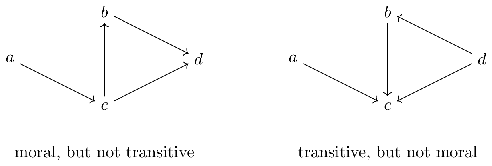

#### Problem Setting

This blog post is about a simple observation I stumbled upon recently. It contrasts the time complexity of two, at first glance, very similar computational tasks on *directed acyclic graphs* (DAGs). On the one hand, the problem of checking whether a DAG is *transitive*, i.e., whether $a \rightarrow b \rightarrow c$ implies $a \rightarrow c$ and, on the other hand, the problem of checking whether a DAG is *moral*[^1], that is $a \rightarrow b \leftarrow c$ implies that $a$ and $c$ are adjacent. The latter notion stems from the [graphical models literature](https://en.wikipedia.org/wiki/Moral_graph). Consider the following graphs as example:

[^1]: The name *moral graph* alludes to the fact that parents of a vertex need to be adjacent, that is *married*. As often, this historical name is less-than-ideal in hindsight. I still decided to keep it so that this blog post is google-able.  

The graph on the left is not transitive, for example due to $a \rightarrow c \rightarrow d$, while $a \rightarrow c \leftarrow d$ implies non-morality of the right graph, in both cases because $a$ and $d$ are non-adjacent.

As the example illustrates, the two problems can be expressed as *induced subgraph isomorphism problems*, that is detecting whether a graph $G$ contains another (in this case fixed) graph $H$ as *induced* subgraph[^2]: We have non-transitivity iff $H_{\text{trans}} = a \rightarrow b \rightarrow c$ and non-morality iff $H_{\text{moral}} = a \rightarrow b \leftarrow c$ is an induced subgraph. Surprisingly, and the main point of this article is that computationally these two problems behave differently:

[^2]: *Induced* means that the subgraph of $G$ needs to have the same non-edges as $H$ as well. See [this article](https://en.wikipedia.org/wiki/Induced_subgraph_isomorphism_problem) as a reference for the considered problem.

**Main Observation:**   
Checking morality of a graph is (easily) possible in linear-time in the size of the graph, while no linear-time algorithm is known for checking transitivity (and such an algorithm appears firmly out-of-reach). 

In the following, I will give evidence for this statement. Before we start a short disclaimer: Most (if not all) results I present here are already known, though somewhat spread out over the literature. I give references whenever possible, in case I missed something relevant, feel free to contact me :)

#### Undirected Graphs

Before we dive into it, let's briefly revisit the more widely studied problem of induced subgraph isomorphism for *undirected graphs*. Here, the phenomenon, that different choices of $H$ with the same number of vertices, lead to different time complexities is well-documented.
Consider the following two graphs:

Here, the subgraph isomorphism problem is hard in case of $H_{\text{triangle}}$ in the sense that no linear-time algorithm is known. In fact, the only known subcubic algorithms are based on fast matrix multiplication, which imply that, at least in theory, the problem is solvable in time $O(n^{2.373})$ (however these algorithms are not practical). See [Wikipedia](https://en.wikipedia.org/wiki/Triangle-free_graph#Triangle_finding_problem) for a more detailed overview of known results. Conversely, for $H_{\text{path}}$ the problem is almost trivially solvable in linear-time $O(n+m)$ (or $O(n^2)$ when expressing the time complexity purely in terms of the number of vertices) due to the following lemma. 

**Lemma** (Folklore)    
Let $G$ be a *connected* undirected graph. Then, $G$ contains an induced subgraph $a - b - c$ if, and only if, it is not complete (i.e. fully connected/a clique).

*Proof.*   
We show two directions. If $G$ contains induced subgraph $a - b - c$, then it is not complete. Conversely, assume $G$ is not complete. Hence, there exist $x$ and $y$, which are non-adjacent. Note that there exists a shortest path from $x$ to $y$ by connectedness of $G$. Clearly, this path is induced, else it would not be shortest. Hence, either we have $x - z - y$ for some $z$ or there exists such a triple on the path.

It immediately follows that, to detect whether a graph contains an induced subgraph $a - b - c$, it suffices to find the connected components of $G$ and check whether each of them is a clique (this can be done by counting edges). 

Indeed, this observation completes the picture for three-vertex undirected graphs $H$ as the remaining graphs are analogues of the discussed cases obtainable by changing edges into non-edges and vice versa. Interestingly, similar (more nuanced) effects also appear on four vertices as discussed in detail in [this paper](https://epubs.siam.org/doi/abs/10.1137/1.9781611973730.111) by Virginia Vassilevska Williams, Joshua R. Wang, Ryan Williams, and Huacheng Yu, which studies all possible cases in this setting. 

We will now get back to DAGs. The two induced subgraphs $H_{\text{trans}}$ and $H_{\text{moral}}$, on the surface, both look similar to the case $H_{\text{path}} = a - b - c$ for undirected graphs, which would be obtained when ignoring edge directions. The following shows that directions matter.

#### Triangle Hardness of Checking Transitivity

We begin by showing that detecting induced subgraph $a \rightarrow b \rightarrow c$ is at least as hard as detecting a triangle in an undirected graph. This is possible by giving a reduction from the latter to the former problem. This reduction has been described e.g. in [this StackExchange post](https://cstheory.stackexchange.com/a/21510). 

We give a version of the reduction, which is a bit easier to illustrate, starting with the triangle detection problem on tripartite graphs. This is justified by the fact that it is as hard to find a triangle in a general graph, as it is to find one in a tripartite one (the reduction is straightforward and works by creating three copies of the initial vertex set). 

Hence, let $G = (V_1 \cup V_2 \cup V_3, E)$ be an instance of the triangle detection problem with partitions $V_1, V_2, V_3$. Then, construct directed graph $D$ with the same vertex set and edges
- $u_1 \rightarrow v_2$ if $u_1 - v_2 \in E$,
- $u_2 \rightarrow v_3$ if $u_2 - v_3 \in E$ and
- $u_1 \rightarrow v_3$ if $u_1 - v_3 \not\in E$,   
where $u_i$, respectively $v_i$, are assumed to be from partition $V_i$. Here is an illustration of this reduction:

Observe that the resulting graph is acyclic by definition. Moreover, if $G$ contains a triangle on vertices $u$, $v$ and $w$, then by construction $D$ contains $u_1 \rightarrow v_2 \rightarrow w_3$ with $u_1$ and $w_3$ non-adjacent. Conversely if $D$ contains induced subgraph $u \rightarrow v \rightarrow w$, then observe that $u, v, w$ are in different copies of $V$ (this is crucial). It follows that $G$ contains a triangle and thus:

**Lemma**   
If there is an $O(n^{2+k})$ algorithm for checking DAG transitivity, then triangle detection in undirected graphs can be solved in time $O(n^{2+k})$.

*Proof.* Construct graph $D$ in time $O(n^2)$. Then, run the $O(n^{2+k})$ algorithm for DAG transitivity to obtain the answer (as argued above).

#### Linear-Time Algorithm for Checking Morality

In contrast, checking whether a graph is moral is possible in linear-time. The algorithm given below is based on the one for checking whether an ordered graph has zero fill-in[^3] given [here](https://epubs.siam.org/doi/abs/10.1137/0213035). Simplified and slightly adapted to our setting, it proceeds as follows: 
1. Compute a topological ordering of the vertices of $G$ (that is a linear ordering of the vertices such that for every edge $u \rightarrow v$ it holds that $u$ comes before $v$ in the ordering). 
2. For each vertex $v$, compute the vertex $u$ with $u \rightarrow v$ such that $u$ is closest to $v$ in the topological ordering. Denote this vertex as $C(v)$. 
3. For each vertex $v$ and every $u \rightarrow v$, check that $u$ and $C(v)$ are adjacent (for $u \neq C(v)$). If this is not the case, terminate and return *"not moral"*. 
4. Return *"moral"*. 

[^3]: We will not go into more details here, but essentially, for a DAG $G$, the undirected graph obtained by ignoring edge directions of $G$ has zero fill-in with regard to any topological ordering of $G$ if, and only if, $G$ does not contain $ a \rightarrow b \leftarrow c$ as induced subgraph. Hence, any algorithm for testing zero fill-in directly translates to one for checking morality. 

**Lemma** ([Rose, Tarjan, Lueker [1976]](https://epubs.siam.org/doi/10.1137/0205021); [Tarjan, Yannakakis [1984]](https://epubs.siam.org/doi/abs/10.1137/0213035); Whitten [1978] (unpublished))  
Let $G$ be a DAG. Testing whether $G$ is moral can be done in linear time in the size of $G$ (that is $O(n+m)$, when $G$ has $n$ vertices and $m$ edges).

*Proof.*   
For the time complexity, observe that the algorithm performs at most one adjacency check per edge. We assume here that adjacency tests are possible in constant time[^4].

[^4]: For sparse graphs, adjacency checks can be performed in *expected* constant time using $O(n+m)$ space when storing the neighbors of each vertex in a hash-table.  Adjacency tests can also be avoided altogether, yielding *worst-case* $O(n+m)$ time (see e.g. the "Test For Zero Fill-In" algorithm in Tarjan, Yannakakis [1984]). I chose the presentation above for clarity. 

We now show correctness. Assume the algorithm returns *not moral*. Then, there exists $u \rightarrow v \leftarrow C(v)$ with $u$ and $C(v)$ non-adjacent in $G$ and thus the output is correct. Conversely, assume $G$ is not moral. Then, there exist non-adjacent $u$ and $w$ (w.l.o.g. assume $u$ comes before $w$ in the topological ordering computed by the algorithm) such that there is $v$ with $u \rightarrow v$ and $w \rightarrow v$. Choose a triple such that $w$ and $v$ are closest of all "immoral" triples. Clearly, the algorithm outputs *not moral* if $w = C(v)$. For this not to be the case, there would need to be a different vertex $w' = C(v)$. It would be adjacent to $u$ and $w$ by assumption that $w$ is closest to $v$ of all vertices participating in immoral triples. However, then $u \rightarrow w' \leftarrow w$ would be an immoral triple with $w$ closer to $w'$ than to $v$. A contradiction. 

Another line of argument is that, when imagining that the algorithm iterates over the topological ordering from left to right, we can assume by induction, when handling $v$ and assuming the algorithm has not terminated yet, that the parents of $C(v)$ are moral. Then, it is clear that it suffices to check whether all other parents of $v$ are connected to $C(v)$ to certify that the parents of $v$ are fully connected as, by induction hypothesis, the parents of $C(v)$ are. This is illustrated in the following picture where $p_1$, $p_2$, $p_3$ are fully connected by induction as parents of $C(v)$.

#### Further Remarks

To reflect why checking morality is easier than checking transitivity, let us try to apply the same reduction from triangle detection. Hence, we construct, in similar spirit as above, for undirected graph $G = (V_1 \cup V_2 \cup V_2, E)$, a DAG $D$ with the same vertex set and edges
- $u_1 \rightarrow v_2$ if $u_1 - v_2 \in G$,
- $u_2 \leftarrow v_3$ if $u_2 - v_3 \in G$ and
- $u_1 \rightarrow v_3$ if $u_1 - v_3 \not\in G$.

By definition the graph is acyclic and, as before, a triangle in $G$ will lead to a $u \rightarrow v \leftarrow w$ in $D$. The issue lies in the reverse direction. If we find $u \rightarrow v \leftarrow w$ in $D$, it might be that $u$ and $w$ are *both* in $V_1$. Then, this does not imply a triangle in $G$. See the following example as illustration:

Here, $G$ does not contain a triangle, however $D$ contains an immorality (marked in red). As the algorithm above suggests, it is likely not possible to get such a reduction to work. Intuitively, the reason is that $a \rightarrow b \rightarrow c$ allows us to distinguish between $a$ and $c$ as one is the child and the other the parent of $b$, whereas for $a \rightarrow b \leftarrow c$ vertices $a$ and $c$ cannot be distinguished which makes the problem combinatorially easier.
It would be interesting to further formalize this argument, e.g., for larger $n$. 

Another question is what happens when dropping the acyclicity requirement?
The linear-time algorithm for checking morality explicitly uses the topological ordering of the vertices and thus cannot be used anymore. If the graph is cyclic (let's say there is still only one edge between any pair of vertices, such graphs are known as *oriented graphs*), it is unclear whether it is possible to solve the problem in linear-time. I tend to think it has similar hardness to triangle-detection, but it is not directly clear how to prove this by reduction. I would be very interested if you have any ideas how to tackle this question :)

*Footnotes:*
