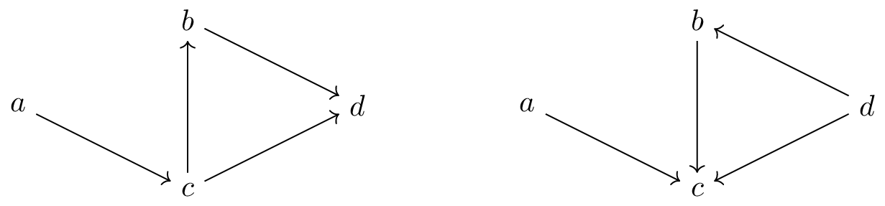

#### Main Observation

This blog post is about a simple but fascinating observation I stumbled upon recently. It contrasts the time complexity of two, at first glance, very similar computational tasks on *directed acyclic graphs* (DAGs). First, consider the task of checking whether a DAG it is transitive, i.e., whether $a \rightarrow b \rightarrow c$ implies $a \rightarrow c$. 
TODO: rewrite such that refer to image for both tasks
See the following example:

This graph contains $a \rightarrow c \rightarrow d$ but not edge $a \rightarrow d$ making it not transitive. 
It is rather easy to show that computationally this task is as hard as detecting whether an undirected graph contains three pairwise connected vertices $a - b - c - a$, also called a triangle (see this [post](https://cstheory.stackexchange.com/a/21510) and the details below). This problem is not known to be solvable in linear-time in the size of the graph despite considerable efforts (try to come up with a linear-time algorithm and you can write a very nice paper if you succeed!).

The main point of this article is that the similar-looking problem of checking whether a DAG contains $a \rightarrow b \leftarrow c$, with $a$ and $c$ non-adjacent, *can* be solved by a simple algorithm in linear-time! This problem is known as *morality*[^1] check (are the parents of vertex $b$ married, that is are they adjacent?) and stems from the [graphical models literature](https://en.wikipedia.org/wiki/Moral_graph). Again let's look at an example graph:

[^1]: As often, not the best name in hindsight. I decided to keep it so that this blog post is google-able.  

Both problems can be phrased in the context of *subgraph isomorphism*. Given a graph $G$, determine for a (in our case) fixed graph $H$, whether $H$ is an induced[^2] subgraph of $G$.

[^2]: Induced means that the non-adjacencies in $H$ also have to be present in the corresponding subgraph of $G$, e.g., $a - b - c$ is a subgraph of the triangle graph, but not an induced one.

Then, as we show below, for DAGs, this problem is computationally harder for $H = a \rightarrow b \rightarrow c$ than for $H = a \rightarrow b \leftarrow c$. That seems weird at first, right? Hopefully, at the end of this blog post you have an intuition why this is the case!

A short disclaimer: Most (if not all) observations and facts I present here are already known, though somewhat strewn over the literature. I give references whenever possible, in case I missed something relevant, feel free to contact me :)

#### Undirected Graphs

Looking a bit more closely, the phenomenon, that different choices of $H$ with the same number of vertices, lead to different time complexities is not so unique.
Let us consider undirected graphs for a moment and contrast the subgraph isomorphism problem for $H = a - b - c, a - c$, i.e., a triangle, with $H = a - b - c$, i.e., a path of length two. Then, the former one is hard in the sense that no linear-time algorithm is known. In fact, the only known subcubic algorithms are based on fast matrix multiplication, which imply that, at least theoretically, the problem is solvable in time $O(n^{2.373})$. Conversely, the latter problem one is almost trivially solvable in linear-time $O(n+m)$ (or $O(n^2)$ when expressing the time complexity purely in terms of the number of vertices) due to the following lemma. 

**Lemma** (Folklore)    
Let $G$ be a connected undirected graph. Then, $G$ contains an induced subgraph $a - b - c$ if, and only if, it is not complete (i.e. fully connected/a clique).

*Proof.*   
We show two directions. If $G$ contains induced subgraph $a - b - c$, then it is not complete. Conversely, assume $G$ is not complete. Hence, there exist $x$ and $y$, which are non-adjacent. Note that there exists a shortest path from $x$ to $y$ by connectedness of $G$. Clearly, this path is induced, else it would not be shortest. Hence, either we have $x - z - y$ for some $z$ or there exists such a triple on the path.

It immediately follows that, to detect whether a graph contains an induced subgraph $a - b - c$, it suffices to find the connected components of $G$ and check whether each of them is a clique (this can be done by counting edges). This observation completes the picture for three-vertex undirected graphs $H$ as the remaining graphs are analogues of the discussed cases obtainable by changing edges into non-edges and vice versa. Interestingly, similar (more nuanced) effects also appear on four vertices as discussed in detail in [this paper](https://epubs.siam.org/doi/abs/10.1137/1.9781611973730.111) by Virginia Vassilevska Williams, Joshua R. Wang, Ryan Williams, and Huacheng Yu, which studies all possible cases in this setting. 

We will now get back to DAGs. The two induced subgraphs $H$ we consider are $a \rightarrow b \rightarrow c$ and $a \rightarrow b \leftarrow c$. On the surface both look similar to the case $a - b - c$ for undirected graphs, which would be obtained when ignoring edge directions. The following shows that directions matter.

#### Triangle Hardness of Checking Transitivity

We begin by showing that detecting $a \rightarrow b \rightarrow c$ is at least as hard as detecting a triangle in an undirected graph. This is possible by giving a reduction from the latter to the former problem. As mentioned above this reduction has been described [here](https://cstheory.stackexchange.com/a/21510). 

Let $G = (V, E)$ be an instance of the triangle detection problem. Then, construct directed graph $D$ with vertex set $V_1 \cup V_2 \cup V_3$, with each $V_i$ being a copy of $V$. Insert edge 
- $u_1 \rightarrow v_2$ for $u_1 \in V_1$, $v_2 \in V_2$ if $u \rightarrow v \in E$,
- $u_2 \rightarrow v_3$ for $u_2 \in V_2$, $v_3 \in V_3$ if $u \rightarrow v \in E$ and
- $u_1 \rightarrow v_3$ for $u_1 \in V_1$, $v_3 \in V_3$ if $u \rightarrow v \not\in E$.

Observe that the resulting graph is acyclic by definition. Moreover, if $G$ contains a triangle $u - v - w$, $u - w$, then by construction $D$ contains $u_1 \rightarrow v_2 \rightarrow w_3$ with $u_1$ and $w_3$ non-adjacent. Conversely if $D$ contains induced subgraph $u \rightarrow v \rightarrow w$, then observe that $u, v, w$ are in different copies of $V$. It follows that $G$ contains a triangle and thus it follows that:

**Lemma**   
If there is an $O(n^{2+k})$ algorithm for checking DAG transitivity, then triangle detection in undirected graphs can be solved in time $O(n^{2+k})$.

*Proof.* Construct graph $D$ in time $O(n^2)$. Then, run the $O(n^{2+k})$ algorithm for DAG transitivity to obtain the answer (as argued above).

#### Linear-Time Algorithm for Checking Morality

In contrast, checking whether a graph is moral is possible in linear-time. The algorithm we give below is based on the one for checking whether an ordered graph has zero fill-in[^3] given [here](https://epubs.siam.org/doi/abs/10.1137/0213035).

[^3]: We will not go into more details here, but essentially, for a DAG $G$, the undirected graph obtained by ignoring edge directions of $G$ has zero fill-in with regard to any topological ordering of $G$ if, and only if, $G$ does not contain $ a \rightarrow b \leftarrow c$ as induced subgraph.

Slightly adapted to our setting, it proceeds as follows:

TODO

**Lemma**   
Let $G$ be a DAG. Testing whether $G$ is moral can be done in time $O(n+m)$. (TODO: make sure n and m are explained)

#### Further Remarks

Let us reflect why checking morality is easier than checking transitivity and try to apply the same reduction from triangle detection as in the latter case. 

Hence, we construct for undirected graph $G = (V, E)$, a DAG $G$ with vertex set $V_1 \cup V_2 \cup V_3$, which again are copies of $V$, and edges
- $u_1 \rightarrow v_2$ if $u - v$ in $G$,
- $u_2 \leftarrow v_3$ if $u - v$ in $G$ and
- $u_1 \rightarrow v_3$ if $u - v$ in $G$.

By definition the graph is acyclic and a triangle in $G$ will lead to a $u \rightarrow v \leftarrow w$ in $D$. The issue lies in the reverse direction. If we find $u \rightarrow v \leftarrow w$ in $D$, it might be that $u$ and $w$ are both in $V_1$. Then, this does not imply a triangle in $G$. As the algorithm above suggests, it is likely not possible to get such a reduction to work.

How about making the problem harder by not demanding acyclicity?
The algorithm explicitly uses the topological ordering of the vertices. If the graph is cyclic (let's say there is still only one edge between any pair of vertices, e.g., we consider *oriented graphs*), it is unclear whether it is possible to solve the problem in linear-time. I tend to think it has similar hardness to triangle-detection, but it is not directly clear how to prove this by reduction.

